# Shopify Clone

#### (Tailwind CSS)
---

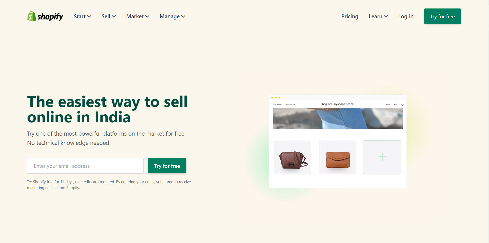
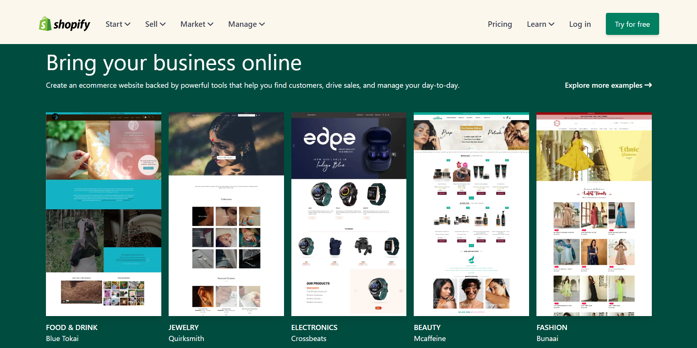
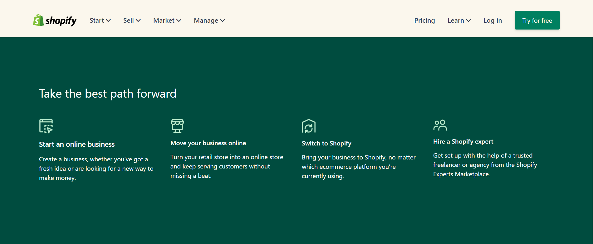
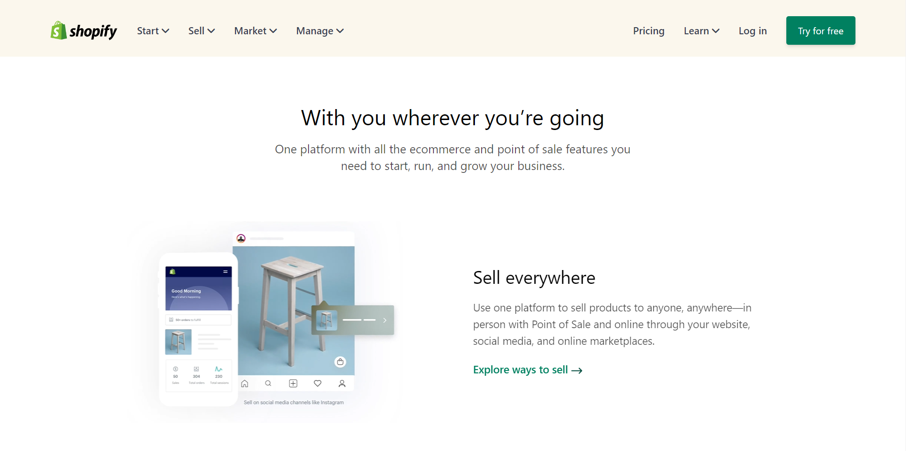
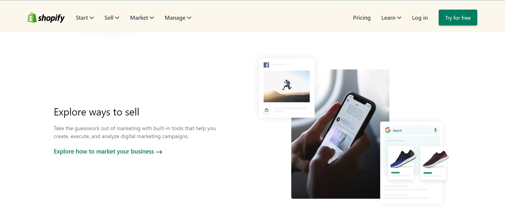
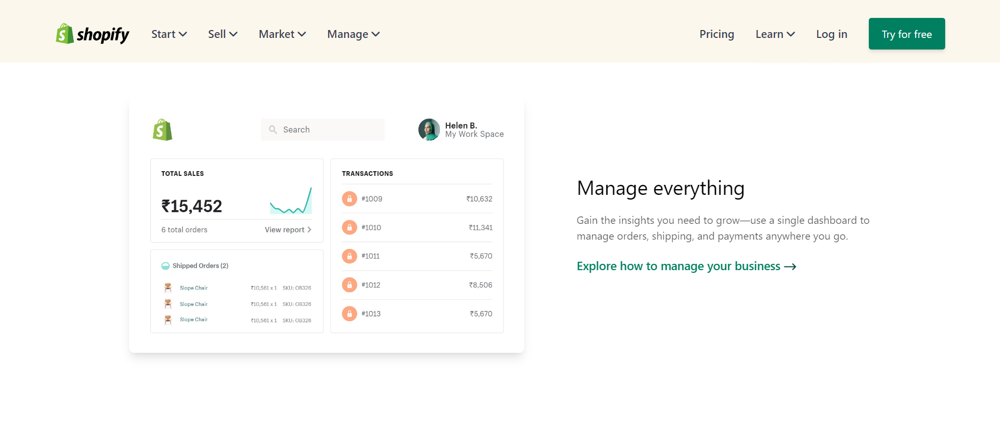
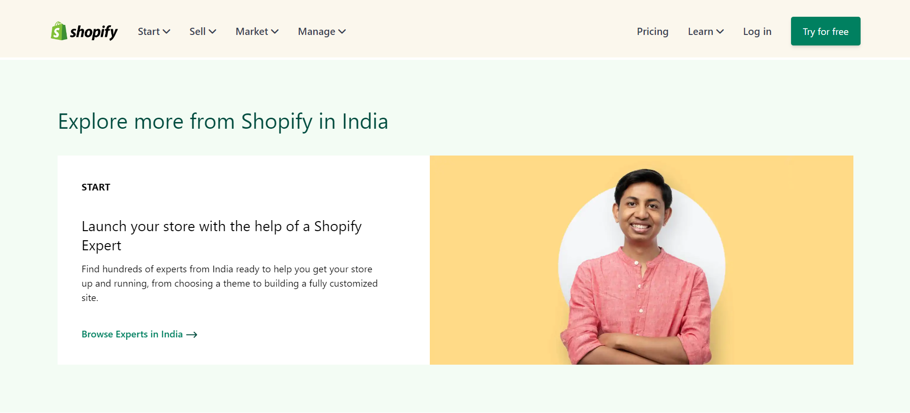
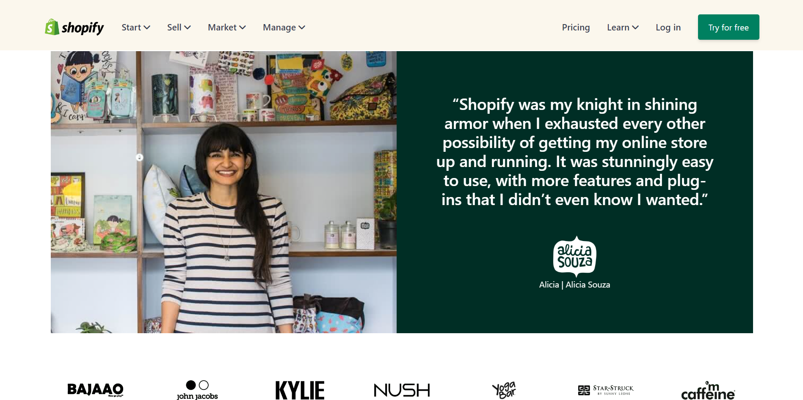
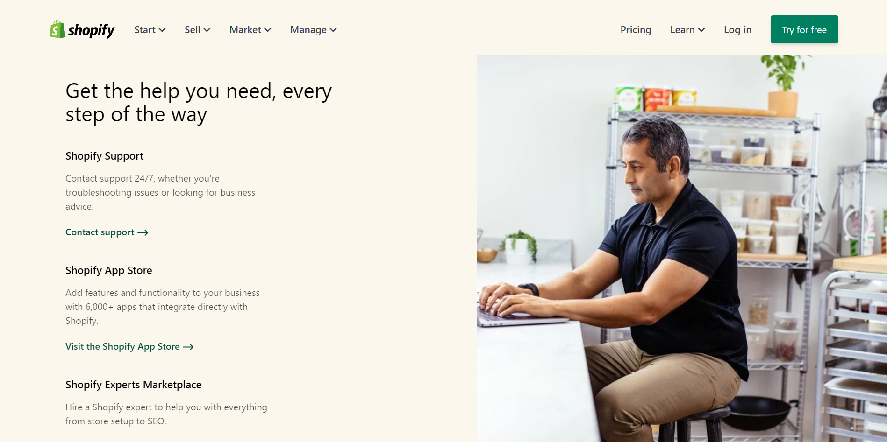
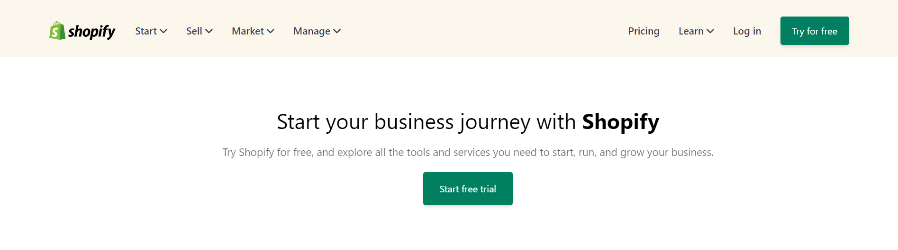
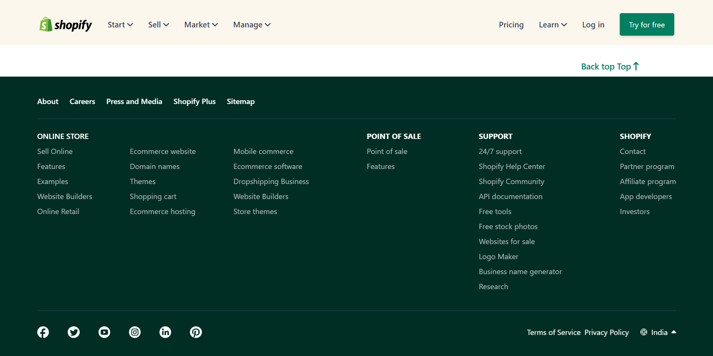

> Screen-Shot of the project.

#

## Built-with
---

This project is created using:

 > Tailwind CSS

#

## Live Project
---

This project is hosted on Netlify.

[Netlify](https://shobhits-shopify-clone.netlify.app/)

#

## Time
---

This project was built within 10 hours.

#

## About
---

Name: **Shobhit Sheta**

  